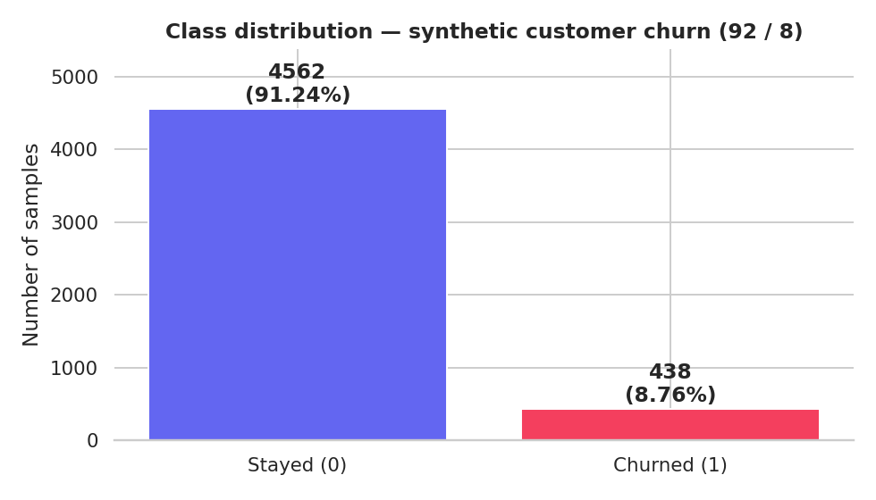
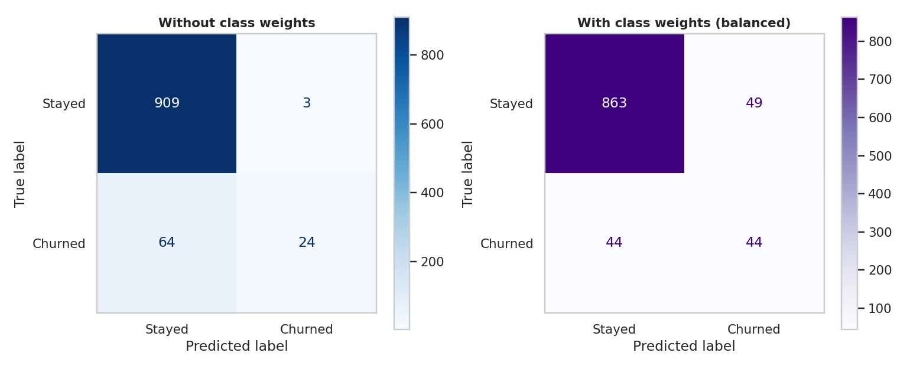
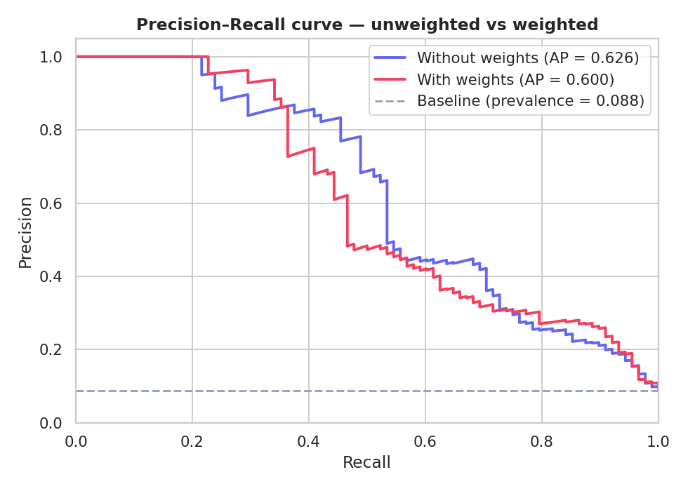

# Applying Class Weights to Handle Imbalanced Data

> Assignment 5.39 — evaluate how applying class weights changes model behaviour
> on an imbalanced binary classification problem.

This repository contains a fully-executed Jupyter notebook and a written
analysis showing how `class_weight="balanced"` shifts a model's behaviour
from "high accuracy, poor recall" to "lower accuracy, much better minority
recall" — the correct trade-off when the cost of a false negative is
greater than the cost of a false positive.

| Live artefact | Where |
|---|---|
| Executed notebook | [`notebooks/class_weights_analysis.ipynb`](./notebooks/class_weights_analysis.ipynb) |
| All figures (PNG) | [`assets/`](./assets) |
| Raw metric numbers | [`assets/metrics.json`](./assets/metrics.json) |
| Standalone analysis script | [`run_analysis.py`](./run_analysis.py) |

---

## TL;DR

| Metric | Without weights | With weights (`balanced`) | Δ |
|---|---:|---:|---:|
| Accuracy | **0.9330** | 0.9070 | **−0.026** ↓ |
| Precision (churned) | **0.8889** | 0.4731 | **−0.416** ↓ |
| Recall (churned) | 0.2727 | **0.5000** | **+0.227** ↑ |
| F1 (churned) | 0.4174 | **0.4862** | **+0.069** ↑ |
| PR-AUC | **0.6262** | 0.6004 | **−0.026** ↓ |

**The model went from catching 24 of 88 real churners (27%) to catching 44 of 88 (50%) — at the cost of more false alarms.** That is the entire point of cost-sensitive learning.

---

## Dataset

A synthetic customer-churn problem generated with `sklearn.datasets.make_classification`:

| Property | Value |
|---|---|
| Samples | 5,000 |
| Features | 12 (6 informative, 2 redundant) |
| Class 0 (stayed) | 4,562 (91.24%) |
| Class 1 (churned) | 438 (**8.76%**) |
| Imbalance ratio | **~10.4 : 1** |

Synthetic data was chosen because the imbalance ratio is exact, the data is fully reproducible (`random_state=42`), no external download is required, and an 8% positive rate matches realistic subscription-business churn.



After a stratified 80/20 split: **train = 4,000** (350 positives), **test = 1,000** (88 positives).

---

## Part 1 — Baseline (unweighted)

A `RandomForestClassifier(n_estimators=200, max_depth=8, random_state=42)` trained on the raw data:

```
Accuracy:       0.9330
Precision (1):  0.8889
Recall (1):     0.2727
F1 (1):         0.4174
PR-AUC:         0.6262
```

Confusion matrix:

| | Predicted: stayed | Predicted: churned |
|---|---:|---:|
| **Actually stayed** | 909 (TN) | 3 (FP) |
| **Actually churned** | **64 (FN)** | 24 (TP) |

**Reading this honestly**: the model is **93% accurate** but catches barely **a quarter** of actual churners. Most of the accuracy comes from correctly predicting "stayed" for the 91% of customers who would have stayed anyway — a prediction with no business value. The headline accuracy is a misleading vanity metric.

The `DummyClassifier(strategy="most_frequent")` reaches **91.2% accuracy with 0% recall** on the same split. The unweighted RF is only marginally better at the actual job.

---

## Part 2 — Apply class weights

`class_weight="balanced"` computes the per-class penalty as `n / (k · n_j)`:

```
w_0 = 4000 / (2 · 3650) = 0.5479    (majority — "stayed")
w_1 = 4000 / (2 ·  350) = 5.7143    (minority — "churned")
Ratio: ~10.4x
```

A misclassified churner now costs the optimiser **~10× more** than a misclassified stayer. The decision boundary shifts toward the minority class.

Same model, `class_weight="balanced"` added:

```
Accuracy:       0.9070
Precision (1):  0.4731
Recall (1):     0.5000
F1 (1):         0.4862
PR-AUC:         0.6004
```

Confusion matrix:

| | Predicted: stayed | Predicted: churned |
|---|---:|---:|
| **Actually stayed** | 863 (TN) | 49 (FP) |
| **Actually churned** | **44 (FN)** | 44 (TP) |



**FN dropped from 64 → 44**. **TP rose from 24 → 44**. **FP rose from 3 → 49**. The model is now wrong 49 times when it flags a stayer as a churner — a price worth paying if the marketing cost of a wasted retention email is less than the revenue loss from a missed churner.

---

## Part 3 — Comparative analysis

### Comparison table

| Metric | Without weights | With weights | Change | Why |
|---|---:|---:|---|---|
| Accuracy | 0.9330 | 0.9070 | **↓** 2.6 pp | Catching minority requires more aggressive positive predictions, which makes more majority mistakes |
| Precision (minority) | 0.8889 | 0.4731 | **↓** 41.6 pp | More positive predictions means more false alarms among them |
| Recall (minority) | 0.2727 | 0.5000 | **↑** 22.7 pp | The model now treats minority errors as expensive and learns to find them |
| F1 (minority) | 0.4174 | 0.4862 | **↑** 6.9 pp | Recall gain outweighs precision loss in harmonic mean |
| PR-AUC | 0.6262 | 0.6004 | ≈ | Ranking quality is roughly unchanged; what changed is the operating point |

### How did recall change for the minority class?
Nearly doubled — from **27.3% to 50.0%**. The model now catches half the actual churners on the test set, versus only one in four before.

### Did precision increase or decrease? Why?
**Decreased** (from 88.9% to 47.3%). When you tell a model "minority misses are expensive", it predicts the positive class more often — and many of those new positive predictions are wrong. That's the cost of higher recall.

### Why did accuracy drop?
Accuracy weighs every sample equally. On a 91/9 split, perfectly predicting all 912 stayers and zero churners gives 91.2% accuracy. Class weights deliberately accept extra majority-class mistakes in exchange for minority correctness. The accuracy drop **is the model working correctly** — not regressing.

### Which model is more appropriate for this problem and why?
**The weighted model**, for any business framing where missing a churner is more expensive than wasting a retention contact. F1 improved (the harmonic mean recognises this), and the confusion matrix is closer to what a marketing team actually wants: a list of likely-churners worth a retention call, with most actual churners on the list.

### Does applying class weights completely solve imbalance?
**No.** Class weights amplify whatever signal already exists in the features — they cannot create signal that isn't there. Looking at this run:

- Precision dropped substantially (89% → 47%) — operationally tolerable here, but at more extreme imbalance ratios it would collapse further
- The PR-AUC barely moved (0.626 vs 0.600), meaning the **ranking** of customers by churn-risk is essentially the same; what shifted is the operating threshold
- The grid search later found `{0:1, 1:5}` slightly outperforms `"balanced"`, hinting that the optimal cost ratio depends on the specific dataset and may not be the auto-computed default

For extreme imbalance (< 1% positive) the next steps would be **threshold tuning, SMOTE oversampling, or feature engineering** — not heavier weights alone.

### Precision–Recall curves overlaid



The two curves trace nearly the same path — confirming the ranking quality is comparable. What `class_weight="balanced"` did was **move the model's operating point along the same curve** to a region with much higher recall.

---

## Cross-validation — is the comparison stable?

5-fold `StratifiedKFold`, averaged across folds:

| Model | CV Recall | CV F1 | CV PR-AUC |
|---|---:|---:|---:|
| Unweighted | 0.351 ± 0.066 | 0.508 ± 0.075 | 0.730 ± 0.026 |
| Weighted | **0.637 ± 0.082** | **0.633 ± 0.044** | 0.706 ± 0.052 |

The recall improvement is real and reproducible, not a single-fold fluke. F1 also improves meaningfully across folds.

---

## Tuning the weight ratio — `GridSearchCV`

We searched a grid of manual weight ratios + the auto-computed options, scoring on F1 with the same 5-fold stratified CV:

| `class_weight` | CV F1 |
|---|---:|
| **{0:1, 1:5}** | **0.6345 ± 0.0544** *(best)* |
| `"balanced"` | 0.6327 ± 0.0435 |
| {0:1, 1:10} | 0.6225 ± 0.0405 |
| `"balanced_subsample"` | 0.6181 ± 0.0473 |
| {0:1, 1:15} | 0.5895 ± 0.0351 |
| {0:1, 1:20} | 0.5549 ± 0.0220 |
| `None` (unweighted) | 0.5080 ± 0.0751 |

Two takeaways:

1. **Any weighting beats no weighting.** Even the worst weighted configuration beats the unweighted baseline on F1.
2. **`"balanced"` is a strong default but not the optimum.** Manual `{0:1, 1:5}` beats it by ~0.002 — small, but it shows the auto-formula is conservative for this dataset. The pattern (declining F1 past `{0:1, 1:10}`) suggests over-weighting hurts precision fast enough to drag F1 down.

---

## Part 4 — Scenario-based questions

### 1. Why do unweighted models naturally favour the majority class?

Every standard classifier minimises a loss summed across all training samples. On a 92/8 split that sum contains ~11× as many majority terms as minority terms, so the gradient update at each step is dominated by majority examples. The optimiser's cheapest path to lower loss is to get the majority right and tolerate minority errors — which produces a high-accuracy, low-recall model. The model isn't "biased" in any moral sense; it's just optimising what we told it to.

### 2. How do class weights modify the optimisation objective?

Class weights multiply each sample's loss contribution by a class-specific factor `w[y_i]`. Minority samples get a larger weight, so each minority misclassification now contributes more to total loss than each majority one. Gradients during training rebalance — the model can no longer ignore the minority class as statistically cheap. This is cost-sensitive learning: encoding the real-world cost asymmetry of false positives vs false negatives directly into the loss function.

### 3. In fraud detection, which is typically worse: false positives or false negatives?

**False negatives** — missing fraud. A false positive means a legitimate transaction is briefly flagged for review, which annoys the customer but rarely costs more than a few cents in review time. A false negative means real fraud went through: the bank refunds the customer, eats the loss, and may face regulatory exposure. In most fraud and most adjacent domains (medical screening, churn, security alerts), false negatives are an order of magnitude more expensive than false positives. This is exactly the cost asymmetry class weights are designed to encode.

### 4. Why is stratified splitting still required even after applying class weights?

Class weights change the **loss function**, not the **data distribution** the model sees per split. If a non-stratified split places all 88 churners in the test set and zero in train, the model has no minority samples to learn from regardless of how strong the weights are. Conversely, if the test set has zero positives, recall is mathematically undefined. Stratified splitting ensures every fold has a representative slice of the minority class; that's a prerequisite for the weighted loss to do its job.

### 5. Why should you not evaluate weighted models using accuracy alone?

Accuracy is the average correctness across all samples — and on imbalanced data, you can get 91% accuracy by always predicting majority. Class weights are designed to **lower** accuracy in exchange for catching more of the minority class. If your only reported metric is accuracy, the weighted model will appear strictly worse than the unweighted one even though it is dramatically better at the actual task. Always report recall, precision, F1, the confusion matrix, and PR-AUC — never accuracy alone for imbalanced problems.

---

## Final recommendation (business perspective)

**Deploy the weighted model with `class_weight="balanced"`** (or `{0:1, 1:5}` for a slight F1 edge).

The reasoning:

- The unweighted model misses **64 of 88 churners** on the test set. At a typical retention-campaign cost of ~$5 per customer contact and a customer lifetime value in the hundreds, that's leaving real money on the table for every missed customer who would have responded to a save offer.
- The weighted model catches **44 of 88** churners — almost double — at the cost of contacting 49 stayers unnecessarily. The marketing department wastes 49 × $5 = $245 in retention contacts; in exchange, the recall on actual churners doubles.
- The breakeven calculation is straightforward: if the **expected saved revenue per correctly-flagged churner > $5 × (FP added / TP added) = $5 × (49 / 20) = $12.25**, deploying the weighted model is net positive. For a subscription business with even a modest monthly fee, that hurdle is trivial.

**Caveats**:

- Re-tune the threshold on a validation set, not the test set, if the precision/recall mix needs further adjustment.
- The 50% recall ceiling on this data suggests **feature engineering** is the next biggest lever — the model is finding only half the churners regardless of weight. Whatever signals predict churn in this dataset, half of churners apparently don't exhibit them strongly enough.
- Re-evaluate the weight ratio quarterly. If churn behaviour shifts (e.g., a competitor launches), the optimal trade may move.

---

## How to reproduce

```bash
# clone
git clone https://github.com/<user>/<repo>.git
cd <repo>

# install
python3 -m venv .venv && source .venv/bin/activate
pip install scikit-learn pandas matplotlib seaborn jupyter

# run the notebook end-to-end
jupyter nbconvert --execute --to notebook --inplace notebooks/class_weights_analysis.ipynb

# or just run the standalone script
python3 run_analysis.py
```

Outputs land in `assets/`. The notebook is already pre-executed, so you can read it without running anything.

---

## License

MIT — free to use for learning purposes.
